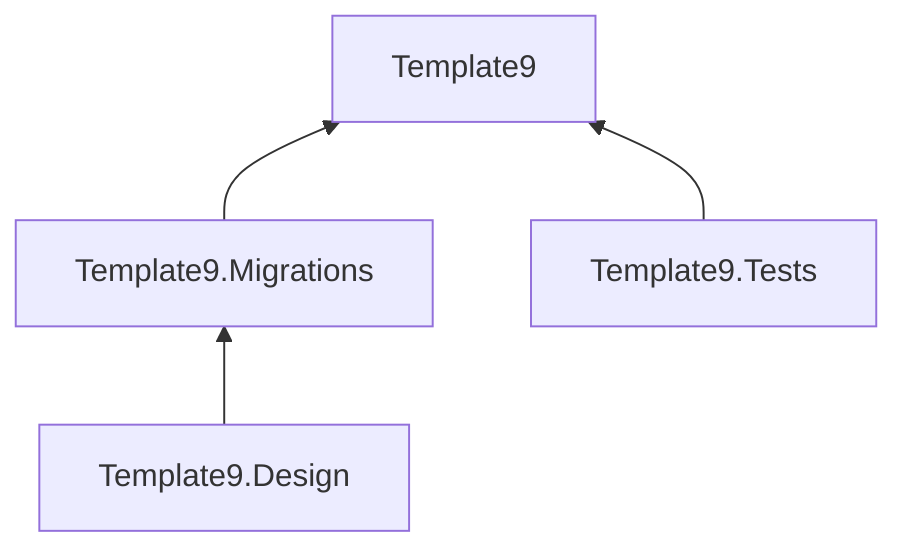

# Template9

This project implements the abstractions from _Your.Interfaces.Project_. The DbContext implementation contained in this package is not intended to be available outside of this project, but rather to be consumed by the interface implementations.

## Related Project Structure

Template9 is implemented using several projects in order separate the concerns of interface implementation, design time services, database migrations and integration testing. The project structure and dependency graph are as follows:

| Project              | Purpose                                                |
|----------------------|--------------------------------------------------------|
| Template9            | Interface implementations, as well as the DbContext    |
| Template9.Design     | Executable project used for database design operations |
| Template9.Migrations | Database migrations                                    |
| Template9.Test       | Integration tests for Template9 implementations        |

### Dependency Graph



> Flowchart generated using [Mermaid Flowcharts](https://github.blog/developer-skills/github/include-diagrams-markdown-files-mermaid/).

## Project Organization

Use the following guidelines to implement repository interfaces.

- Implement each repository interface in its own directory.
- Each directory will contain a `CompositionExtensions` class
- Each directory will have subdirectories for `Commands` and `Queries`
- Each command and query will have an interface and an implementation
- The only methods defined on commands and queries will be named `Execute`
- Multiple `Execute` methods may be defined
- An instance of `ILogger<T>` and `IDbContextFactory<ProjectDbContext>` will be injected into each command and query
- Each interface implementation will have all of the command and query interfaces injected into it.
- Interface implementations and command and query class will be registered in the directory level `CompositionExtensions` as a singleton

```
Template9/
├── Person/
|   ├── Commands
│   |    └── IPersonDeleteCommand.cs
│   |    └── IPersonInsertCommand.cs
│   |    └── IPersonUpdateCommand.cs
│   |    └── PersonDeleteCommand.cs
│   |    └── PersonInsertCommand.cs
│   |    └── PersonUpdateCommand.cs
|   ├── Queries
│   |    └── IPersonGetAllQuery.cs
│   |    └── IPersonGetByIdQuery.cs
│   |    └── PersonGetAllQuery.cs
│   |    └── PersonGetByIdQuery.cs
│   └── CompositionExtensions.cs
│   └── PersonRepository.cs
├── CompositionExtensions.cs
├── DatabaseOptions.cs
└── ProjectDbContext.cs
```

## Docker Container

This project template includes a docker container running a database instance. The test project is already configured to use the database instance in this docker container. With Docker running locally, start the container by executing the following from the command line:

```
$ docker compose up -d
```

Connect to the database in the container using a client application like [DBeaver](https://dbeaver.io/) or [Azure Data Studio](https://azure.microsoft.com/en-us/products/data-studio) using the following settings:

| Property | Value     |
|----------|-----------|
| Host     | localhost |
| Database | $(DatabaseName) |
| Port     | $(DatabasePort) |
| Username | $(DatabaseUser) |
| Password | $(DatabasePwd) |